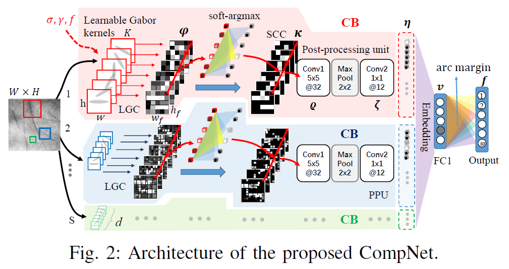
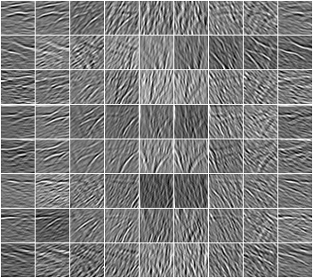
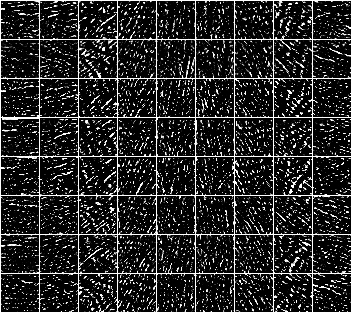
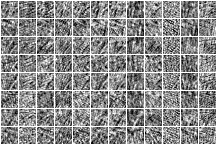

# CompNet
CompNet: Competitive Neural Network for Palmprint Recognition Using Learnable Gabor Kernels [[paper]](https://ieeexplore.ieee.org/document/9512475)




## 1. Supplementary Materials

- Supplementary Material: [pdf](https://github.com/xuliangcs/compnet/blob/main/Supplementary%20Material.pdf)

- Pretrained Models: [[]]() 

- Publicly Available Datasets: [Tongji](https://sse.tongji.edu.cn/linzhang/contactlesspalm/index.htm), [IITD](https://www4.comp.polyu.edu.hk/~csajaykr/IITD/Database_Palm.htm), [REST](www.regim.org/publications/databases/regim-sfax-tunisian-hand-database2016-rest2016/),[NTU](https://github.com/BFLTeam/NTU_Dataset), [XJTU-UP](https://gr.xjtu.edu.cn/en/web/bell)


## 2. Visualizations


**CB17x17_Gabor** feature maps obtained at different epoch



**CB17x17_SCC** feature maps obtained at different epoch


**CB7x7_Conv1** feature maps obtained at different epoch 



**CB17x17_Conv2** feature maps obtained at different epoch


## 3. Citation

If it helps you, we would like you to cite the following paper:

```tex
@article{liang2021compnet,  
author={Liang, Xu and Yang, Jinyang and Lu, Guangming and Zhang, David},  
journal={IEEE Signal Processing Letters},   
title={CompNet: Competitive Neural Network for Palmprint Recognition Using Learnable Gabor Kernels},   
year={2021},  
volume={},  
number={},  
pages={1-1},  
doi={10.1109/LSP.2021.3103475}}
```

X. Liang, J. Yang, G. Lu and D. Zhang, "CompNet: Competitive Neural  Network for Palmprint Recognition Using Learnable Gabor Kernels," IEEE Signal Processing Letters, doi: 10.1109/LSP.2021.3103475.


## 4. PyTorch Implementation
**Requirements**

- pytorch-1.2.0 
- torchvision-0.4.0
- python-3.7.4
- anaconda-4.9.0
- opencv-3.2.7 


**Configurations**

1. modify `path1` and `path2` in `genText.py`

    - `path1`: path of the training set (e.g., Tongji session1)
    - `path2`: path of the testing set (e.g., Tongji session2)
    
2. modify `num_classes` in `train.py` and `test.py`
    - Tongji: 600, IITD: 460, REST: 358, XJTU-UP: 200, KTU: 145
    
3. modify `python_path` in `train.py` and `test.py` according to which python you are using. ('python')

**Commands**

```shell
cd path/to/CompNet/

#in the CompNet folder:

#generate the training and testing data sets
python ./data/genText.py
mv ./train.txt ./data/
mv ./test.txt ./data/

#train the network
python train.py

#test the model
python test.py

#inference
python inference.py

#Metrics
#obtain the genuine-impostor matching score distribution curve
python    getGI.py   ./rst/veriEER/scores_xxx.txt    scores_xxx

#obtain the EER and the ROC curve
python    getEER.py   ./rst/veriEER/scores_xxx.txt    scores_xxx
```
The `.pth` file will be generated at the current folder, and all the other results will be generated in the `./rst` folder.


```shell
compnet(
  (cb1): CompetitiveBlock(
    (gabor_conv2d): GaborConv2d()
    (argmax): Softmax(dim=1)
    (conv1): Conv2d(9, 32, kernel_size=(5, 5), stride=(1, 1))
    (maxpool): MaxPool2d(kernel_size=2, stride=2, padding=0, dilation=1, ceil_mode=False)
    (conv2): Conv2d(32, 12, kernel_size=(1, 1), stride=(1, 1))
  )
  (cb2): CompetitiveBlock(
    (gabor_conv2d): GaborConv2d()
    (argmax): Softmax(dim=1)
    (conv1): Conv2d(9, 32, kernel_size=(5, 5), stride=(1, 1))
    (maxpool): MaxPool2d(kernel_size=2, stride=2, padding=0, dilation=1, ceil_mode=False)
    (conv2): Conv2d(32, 12, kernel_size=(1, 1), stride=(1, 1))
  )
  (cb3): CompetitiveBlock(
    (gabor_conv2d): GaborConv2d()
    (argmax): Softmax(dim=1)
    (conv1): Conv2d(9, 32, kernel_size=(5, 5), stride=(1, 1))
    (maxpool): MaxPool2d(kernel_size=2, stride=2, padding=0, dilation=1, ceil_mode=False)
    (conv2): Conv2d(32, 12, kernel_size=(1, 1), stride=(1, 1))
  )
  (fc): Linear(in_features=9708, out_features=512, bias=True)
  (drop): Dropout(p=0.25, inplace=False)
  (arclayer): ArcMarginProduct()
)
```


## Acknowledgement

Portions of the research use the REST'2016 Database collected by the Research Groups in Intelligent Machines, University of Sfax, Tunisia. We would also like to thank the organizers (IITD, Tongji, REgim, XJTU, and NTU) for allowing us to use their datasets. 


## Other References

[1] Deng,  J.  Guo,  N.  Xue  and  S.  Zafeiriou,  “ArcFace:  Additive  angularmargin  loss  for  deep  face  recognition,” in Proc. IEEE/CVF Conf.Comput. Vis. Pattern Recognit., Jun. 2019, pp. 4690–4699.

[2] Chen, W. Li, L. Sun, X. Ning, L. Yu, and L. Zhang, “LGCN: LearnableGabor convolution network for human gender recognition in the wild,” IEICE Trans. Inf. Syst., vol. E102D no. 10, pp. 2067–2071, Oct. 2019.

[3] Arcface PyTorch Implementation. [Online]. Available: [https://github.com/ronghuaiyang/arcface-pytorch](https://github.com/ronghuaiyang/arcface-pytorch) (`ArcMarginProduct`)

[4] A. Genovese, V. Piuri, K. N. Plataniotis and F. Scotti, “PalmNet: Gabor-PCA convolutional networks for touchless palmprint recognition,” IEEE Trans. Inf. Forensics Secur., vol. 14, no. 12, pp. 3160–3174, Dec. 2019. doi: 10.1109/TIFS.2019.2911165. [PalmNet](https://github.com/AngeloUNIMI/PalmNet)

